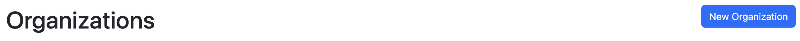
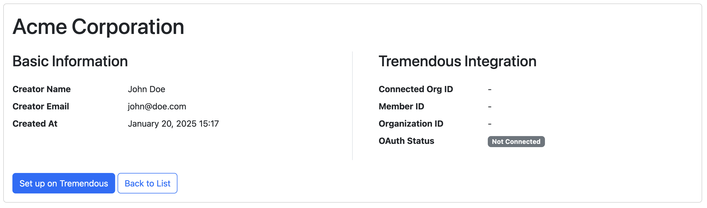
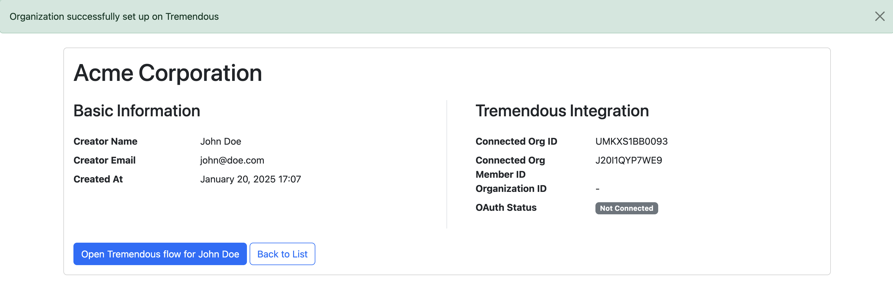
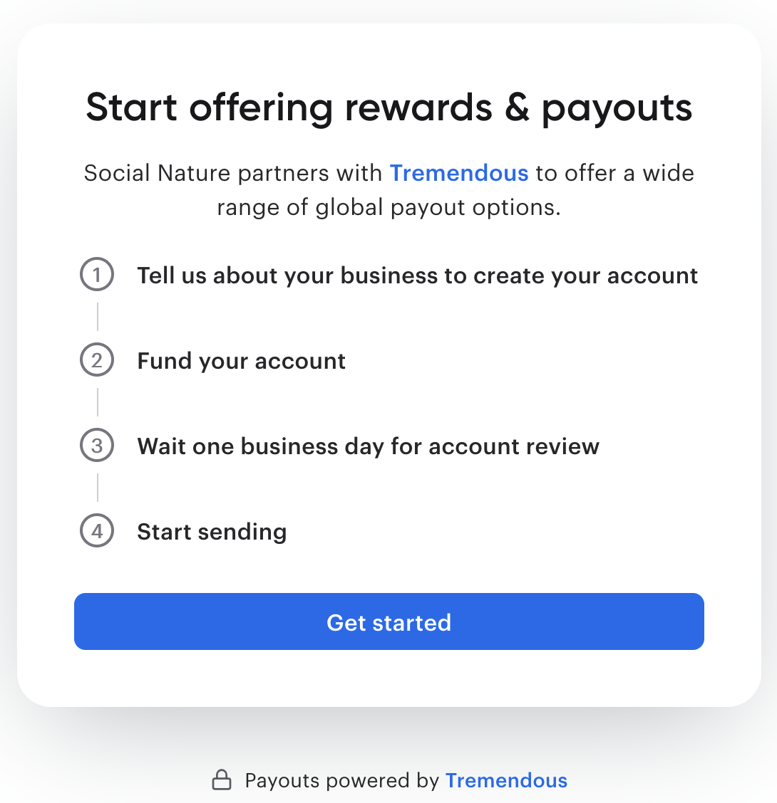
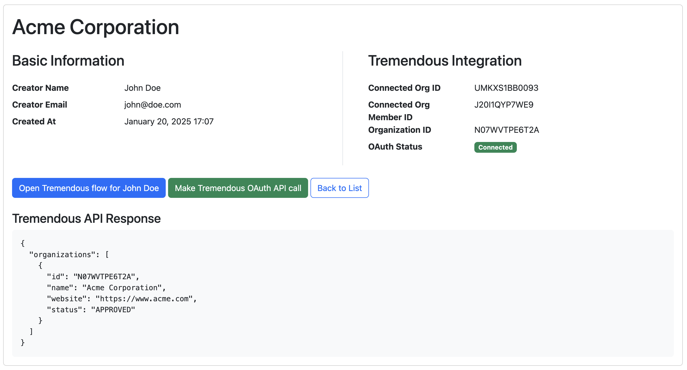

# Tremendous for Platforms sample app

This is a sample application that demonstrates how to integrate with Tremendous for Platforms.

## Steps to integrate

This section assumes that:
- you already have a Tremendous account
- you already have an [API key](https://developers.tremendous.com/docs/api-key)
- you already have an [OAuth application](https://developers.tremendous.com/docs/oauth-20#step-1-register-a-developer-app)
- you completed the [setup instructions](#setup) below and the sample app is up and running

### Onboarding accounts

1. Create an organization by clicking the "New Organization" button on the root page
   

2. Fill in the form and click "Create", saving your new organization
   

3. Click "Set up on Tremendous", which will:
   1. [Create a connected organization](https://github.com/tremendous-rewards/tremendous-for-platforms-sample-app/blob/acf796c145a8eec2f3f538735f4e674cc9b17bba/controllers/organizations_controller.rb#L41-L47) by making an [API call to the connected_organizations endpoint](https://github.com/tremendous-rewards/tremendous-for-platforms-sample-app/blob/acf796c145a8eec2f3f538735f4e674cc9b17bba/services/tremendous_api_service.rb#L8-L16)
   2. [Create a connected organization member](https://github.com/tremendous-rewards/tremendous-for-platforms-sample-app/blob/acf796c145a8eec2f3f538735f4e674cc9b17bba/controllers/organizations_controller.rb#L49-L59) by making an [API call to the connected_organization_members endpoint](https://github.com/tremendous-rewards/tremendous-for-platforms-sample-app/blob/acf796c145a8eec2f3f538735f4e674cc9b17bba/services/tremendous_api_service.rb#L18-L34)
   3. If both calls were successful, you'll see the "Connected Org ID" and "Connected Org Member ID" fields populated on the "Tremendous Integration" section
   

4. Click "Open Tremendous flow for [Creator Name]" button to start the flow on Tremendous' side, which will:
   1. [Make a call to the backend](https://github.com/tremendous-rewards/tremendous-for-platforms-sample-app/blob/acf796c145a8eec2f3f538735f4e674cc9b17bba/views/organizations/show.erb#L50) to retrieve a session URL from Tremendous
   2. The [backend](https://github.com/tremendous-rewards/tremendous-for-platforms-sample-app/blob/acf796c145a8eec2f3f538735f4e674cc9b17bba/controllers/organizations_controller.rb#L74-L79) will make an[ API call](https://github.com/tremendous-rewards/tremendous-for-platforms-sample-app/blob/acf796c145a8eec2f3f538735f4e674cc9b17bba/services/tremendous_api_service.rb#L36-L46) to get a new session URL from Tremendous
   3. These URLs are temporary and should never be stored
   4. The backend will [return the URL to the frontend](https://github.com/tremendous-rewards/tremendous-for-platforms-sample-app/blob/acf796c145a8eec2f3f538735f4e674cc9b17bba/controllers/organizations_controller.rb#L81), which will [redirect the user to the session URL](https://github.com/tremendous-rewards/tremendous-for-platforms-sample-app/blob/acf796c145a8eec2f3f538735f4e674cc9b17bba/views/organizations/show.erb#L70-L90)
   

### Listening for webhooks

This sample app shows how to listen for webhooks from Tremendous. These are handled by the [WebhooksController](https://github.com/tremendous-rewards/tremendous-for-platforms-sample-app/blob/main/controllers/webhooks_controller.rb) and are expected to be received in the `/webhooks` path.
When [creating your webhook in Tremendous](https://developers.tremendous.com/reference/create-webhook), the `url` field should be set to `https://[YOUR-HOSTNAME]/webhooks`.
See the [ngrok setup](#ngrok-setup) section for more details on how to make this sample app publicly accessible from your local machine.

The following sections describe the two webhooks supported by this sample app.

#### `CONNECTED_ORGANIZATIONS.REGISTERED`

This webhook is triggered when your customer goes through the Tremendous for Platforms flow.
When receiving it, the sample app will [process the payload](https://github.com/tremendous-rewards/tremendous-for-platforms-sample-app/blob/acf796c145a8eec2f3f538735f4e674cc9b17bba/controllers/webhooks_controller.rb#L20-L22) and update the organization with the Tremendous organization ID.

This webhook can also be used to inform your system that the end-user has completed the flow, and the organization is pending review by Tremendous.

#### `CONNECTED_ORGANIZATIONS.OAUTH.GRANTED`

This webhook is triggered once the organization is approved by Tremendous.
If you want the OAuth integration to be seamless to the end-user, and not require any manual action to authorize your OAuth application by them, you should listen for this webhook.
When receiving it, this app [fetches the OAuth grant code from the payload](https://github.com/tremendous-rewards/tremendous-for-platforms-sample-app/blob/acf796c145a8eec2f3f538735f4e674cc9b17bba/controllers/webhooks_controller.rb#L24-L27). It then [triggers the OAuth flow](https://github.com/tremendous-rewards/tremendous-for-platforms-sample-app/blob/acf796c145a8eec2f3f538735f4e674cc9b17bba/services/tremendous_oauth_api_service.rb#L11-L17) to retrieve the OAuth tokens (access and refresh).

To make it easier to manage the OAuth boilerplate, this sample app uses the `oauth2` Ruby gem.

### Making API calls on behalf of customers

Tremendous supports [OAuth 2.0 authentication](https://developers.tremendous.com/docs/oauth-20), allowing you to securely make API calls on behalf of your customers.

You'll need to have both a OAuth access token and a refresh token for the organization. There are two ways to get these tokens:

1. Listen to the `CONNECTED_ORGANIZATIONS.OAUTH.GRANTED` webhook, and refer to the [webhooks section](#listening-for-webhooks) for more details on how to handle it
   - this option will make the OAuth integration seamless to the end-user, and requires no further manual action
2. If webhooks are not configured, once the organization is approved by Tremendous and the first time the end-user accesses the Tremendous for Platforms flow, the OAuth authorization flow will be triggered automatically
   - when the end-user authorizes the OAuth application, they'll be redirected back to the platform, to the `return_uri` configured when registering the OAuth application
   - please refer to the [OAuth 2.0 docs](https://developers.tremendous.com/docs/oauth-20#step-3-create-an-oauth-authorization-request) for more details

Once the OAuth flow is completed and you have the tokens, you can make API calls on behalf of the customer. This functionality is demonstrated via the "Make Tremendous OAuth API call" button (which becomes available once the OAuth flow is completed).
Clicking it will trigger an [API call](https://github.com/tremendous-rewards/tremendous-for-platforms-sample-app/blob/acf796c145a8eec2f3f538735f4e674cc9b17bba/services/tremendous_oauth_api_service.rb#L19-L23) using the [OAuth tokens](https://github.com/tremendous-rewards/tremendous-for-platforms-sample-app/blob/acf796c145a8eec2f3f538735f4e674cc9b17bba/services/tremendous_oauth_api_service.rb#L65-L72) for that organization.

The example in the code uses the `oauth2` Ruby gem to handle the OAuth boilerplate.

Please refer to the [Tremendous API docs](https://developers.tremendous.com/reference/create-order) for more details on any other supported endpoints.

.

## Setup instructions

### Requirements

- Ruby 2.7+
- Bundler
- SQLite3

### Setup

1. Install dependencies:
   ```bash
   bundle install
   ```

2. Create database and run migrations:
   ```bash
   bundle exec rake db:create
   bundle exec rake db:migrate
   ```

3. Configure your environment:
   - Check `.env.example` to see what environment variables are needed
   - Create your own `.env`, using `.env.example` file as a base, and update the blank keys with the appropriate values for your environment

4. Start the server:
   ```bash
   bundle exec rackup
   ```

5. Visit http://localhost:9292 in your browser
   1. The application starts with the organizations page
   2. Click on the "New Organization" button to add a new organization and fill in the form
   3. Click "Set up on Tremendous" to create the appropriate setup on Tremendous; you only need to do this once per organization
   4. You'll then see a new button "Open Tremendous flow for X"; clicking it will start the flow on Tremendous's side
   5. Once your newly created organization is reviewed and approved by Tremendous, and the webhook has
   been processed, the "OAuth Status" will change to "Connected"

#### ngrok setup {#ngrok-setup}

When testing the flow end-to-end, this application needs to be publicly accessible. Tremendous will
redirect back to the platform from the Tremendous for Platforms flow, or when sending webhooks.
This can be easily achieved by using a service like [ngrok](https://ngrok.com/).

Just make sure to boot the app with:
```bash
RACK_ENV=production bundle exec rackup -o 0.0.0.0
```

And then, on another terminal, start `ngrok` with:
```bash
ngrok http 9292
```

You can then use the ngrok public URL whenever you need to set up anything on Tremendous pointing to this app:
- set `return_uri` when [registering the OAuth application](https://developers.tremendous.com/docs/oauth-20#step-1-register-a-developer-app) to `https://<your-ngrok-domain>/callback`
- set `url` when [configuring the webhook](https://developers.tremendous.com/reference/create-webhook) to `https://<your-ngrok-domain>/webhooks`
- set `TREMENDOUS_RETURN_URL` in your `.env` file to `https://<your-ngrok-domain>/organizations/%{id}` so that it's used as the return URL when setting up new session URLs
